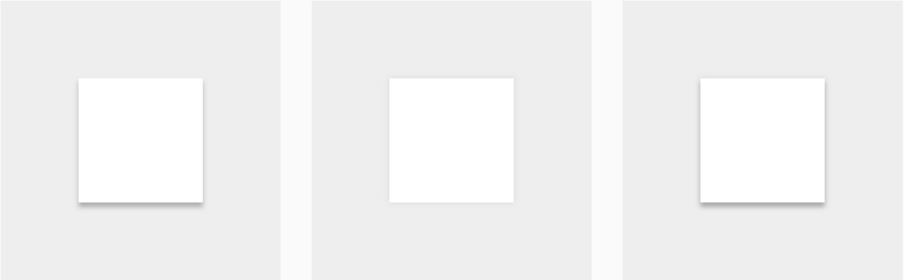

# 概念

## 3D
每個物件都是處於一個3D的空間的物件，而空間中代表Z座標的方向軸是朝使用者延伸。每個物件皆用X和Y座標代表長寬，Z代表距離基底的高度，並且都有著固定**1dp**的厚度。

## 陰影
由兩點模擬光源照射而成，一點在正上方偏上(下圖左)，一點在正上方(下圖中)，整合兩個光源的陰影即可產生一個柔和的陰影效果(下圖右)。

陰影等同是Z座標的表徵，物件在基底上產生的陰影，將直接對應到其與基底的距離。

## 疊加性
每個物件在XY軸上所涵蓋的空間不會重複。以下圖為例，當兩個物件的XY範圍相同時，則畢竟有Z方向的高低落差。

## 穿透性
物件本身不具任何穿透性，所以當一物件覆蓋於另一物件上時，碰觸上方的物件並不會影響下方物件。以下圖為例，當上方物件已經接收此碰觸事件後，即使有碰觸到下方物件也不會觸發任何事情。

## 最低高度
物件本身的最低高度取決於其下一層，下一層越高，則物件的最低高度越高。也就是說不可以穿透下一層，使物件高度低於原本的下層。

## 形變
物件的形狀變化，僅限於以下幾個規則
* 物件可在形狀間轉換。
* 物件縮放僅限XY方向。
* 物件不可折疊或彎曲。
* 物件可由多數物件合成；當移除物件的某一部份，剩下的部分會合一。

## 位移
物件在座標系中的移動，僅限於以下幾個規則
* 物件可在XY方向任意移動。
* 物件僅由使用者操作來引發Z方向的位移。