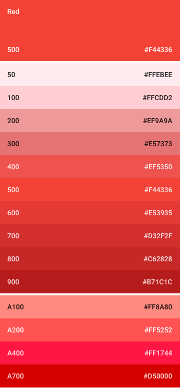

# 顏色

## 色票
Google官方色票的每一色系皆是由主要色調(50 ~ 900)和次要色調(A100 ~ A700)組成。

[**Google 官方色票下載**](http://material-design.storage.googleapis.com/publish/material_v_4/material_ext_publish/0B0J8hsRkk91LSGx6b0w3WWpMQ1k/color_swatches.zip)

下圖以紅色為例，上方為主要色調，下方為次要色調，最上方的500色調為Google建議的主題色調。

## 自訂色票
自訂色票應包含主題色和強調色，並且被設計成彼此可以和諧的相容。

[**Google 官方範例**](http://developer.android.com/training/material/theme.html#ColorPalette)

色票挑選步驟如下：

* 選擇一色系，主要色票中的500色調為主題色，再選擇最多三個不同色調的顏色。 

* 選擇另一色系，從次要色票中選擇一強調色。

## 文字顏色
運用透明度來進行文字的顏色，透過深淺不同來呈現各文字區塊的權重。

文字顏色可大分為以下兩種情境：
* 主題色為亮色系

* 主題色為暗色系

## 圖示顏色
此處表示位於工具列、按鈕等不同顏色區塊中的系統圖示，因此單純套用黑或白的顏色，可使得圖標適用於各種不同顏色的色塊。

顏色可分別使用於以下兩種情境：
* 主題色為亮色系

* 主題色為亮色系

## 狀態欄和工具列
大型色塊如工具列底色應為主題色；狀態欄則應為同一色系且色調700。

## 強調色
通常用於主要按鈕、切換元件等需要強調的部份。

> 
主要按鈕

> 
切換元件

強調色如果不足以明顯表示出重點部份，則可以調整其深淺程度來達到目的。如果強調色完全不適用，則在白底時可以使用主題色代替；在主題色為底時用全白或是54%黑色代替。

## 主題模板
Google官方提供了基本的模板，內含各種基礎物件。

[Google 官方模板](http://material-design.storage.googleapis.com/publish/material_v_4/material_ext_publish/0B0J8hsRkk91LOGV6Y3V2WFhhemM/stickersheet_uielements.ai)

設計師可在模板中更改顏色，並同時看到當前選擇，對於各個物件在顏色上呈現的效果，以此來快速的選定產品的主題色和強調色。
