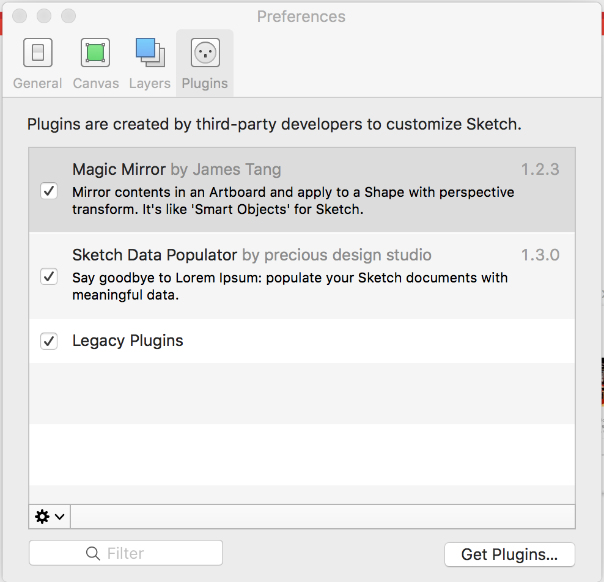
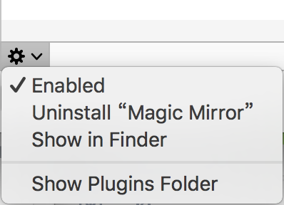
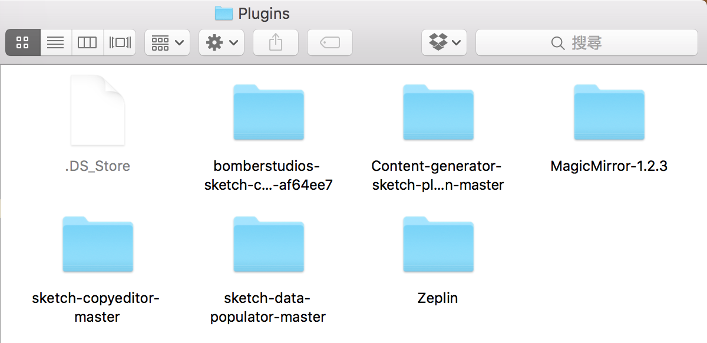
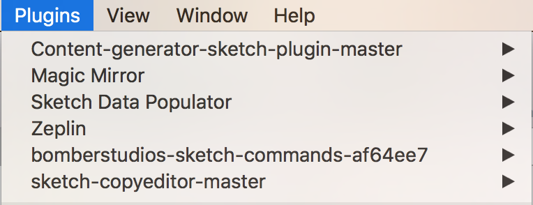

# Plugin

套件可以讓Sketch使用起來更方便，加速產品流程。

> [安裝方式](#安裝方式)

## 安裝方式

1. 先下載Plugin
2. 打開Sketch
3. 點選上方工具列的Plugins -> Manage Plugins

4. 點選下方的齒輪按鈕，從下拉選單中點選Show Plugins Folder

5. 將先前下載的plugin資料夾放入此資料夾

6. 資料夾名稱與Sketch中的Plugin列表相同

