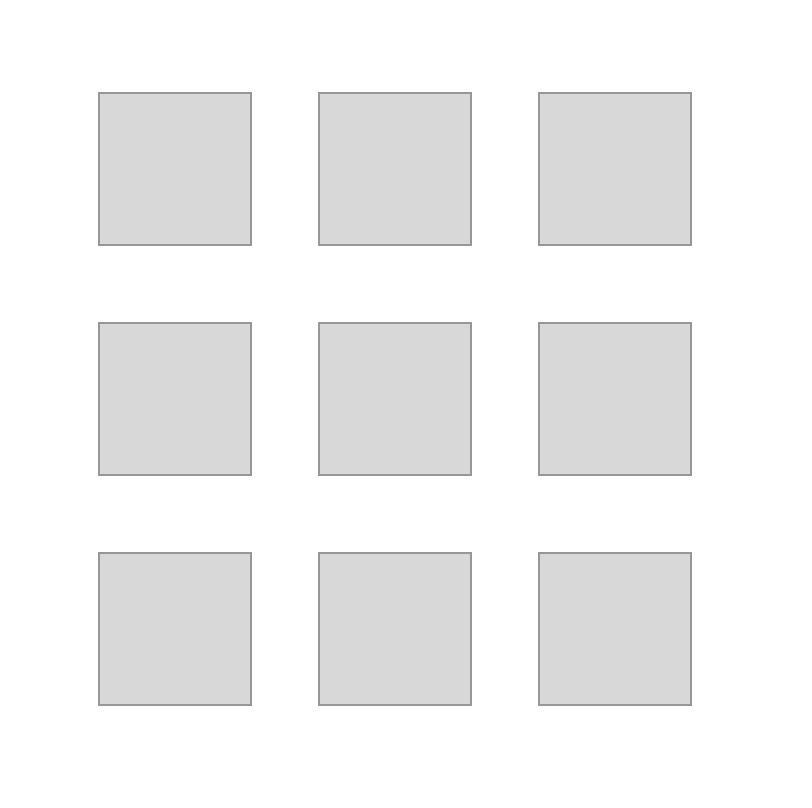
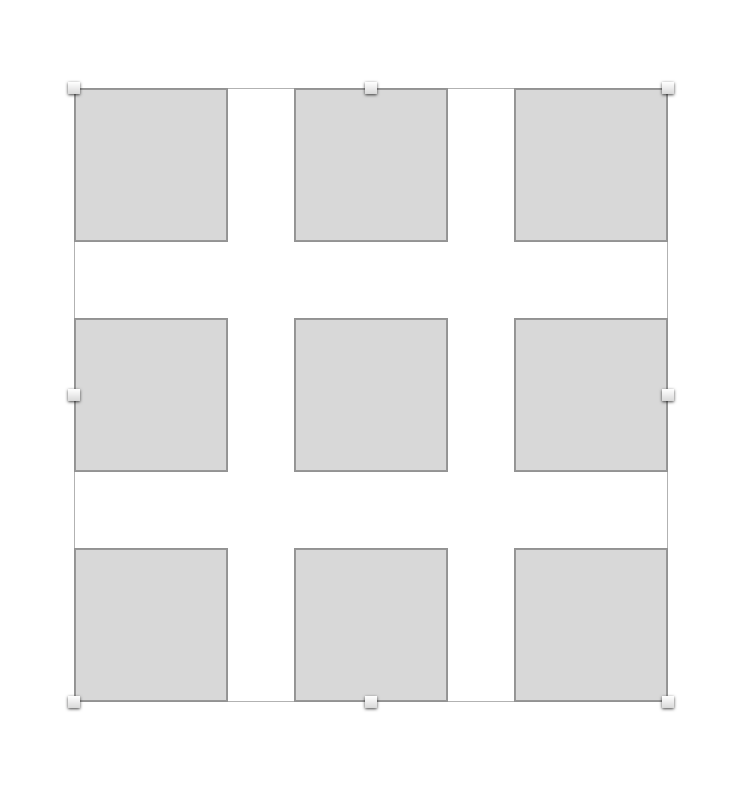
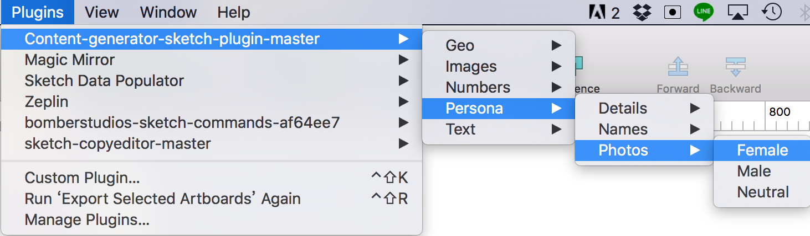
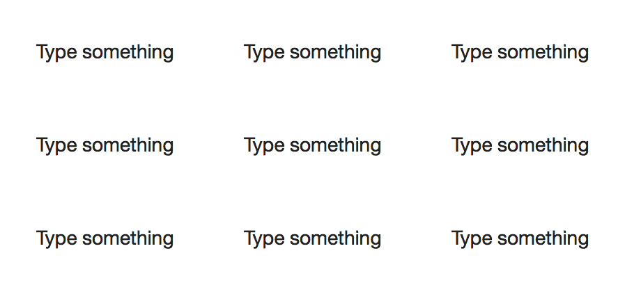
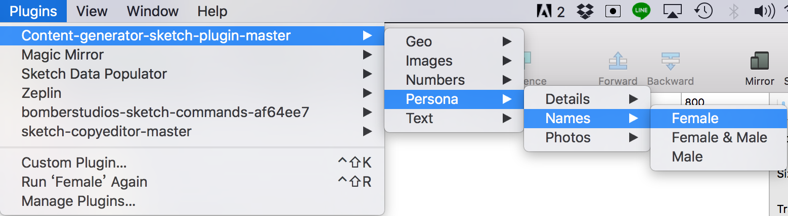

# ContentGenerator

用於在一系列的區塊中產生隨機資料，如人名、地址或內文等。

> [安裝方式](#安裝方式)

## 安裝方式

1. 先至[Github](https://github.com/timuric/Content-generator-sketch-plugin)下載專案

2. 參照[Plugin](README.md)章節安裝

## 產生圖片
1. 產生數個空白區塊  

> 
如要產生的資料為大頭照，則區塊則限定只能正方或正圓

2. 圈選所有區塊

3. 從Plugin -> Content Generator選擇一種屬於圖片的類型

4. 完成

## 產生文字
1. 產生數個文字區塊

2. 圈選所有區塊

3. 從Plugin -> Content Generator選擇一種屬於文字的類型

4. 完成

