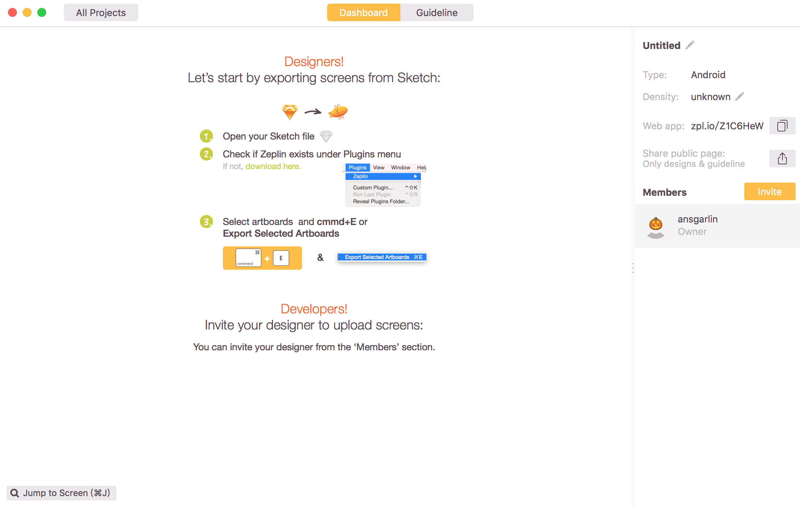
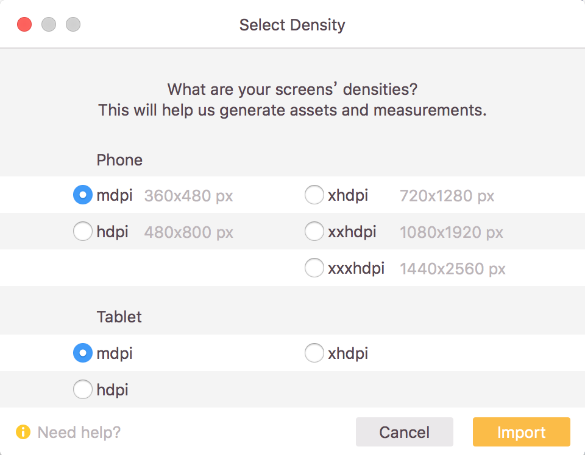
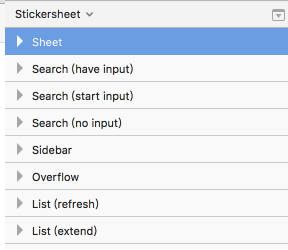
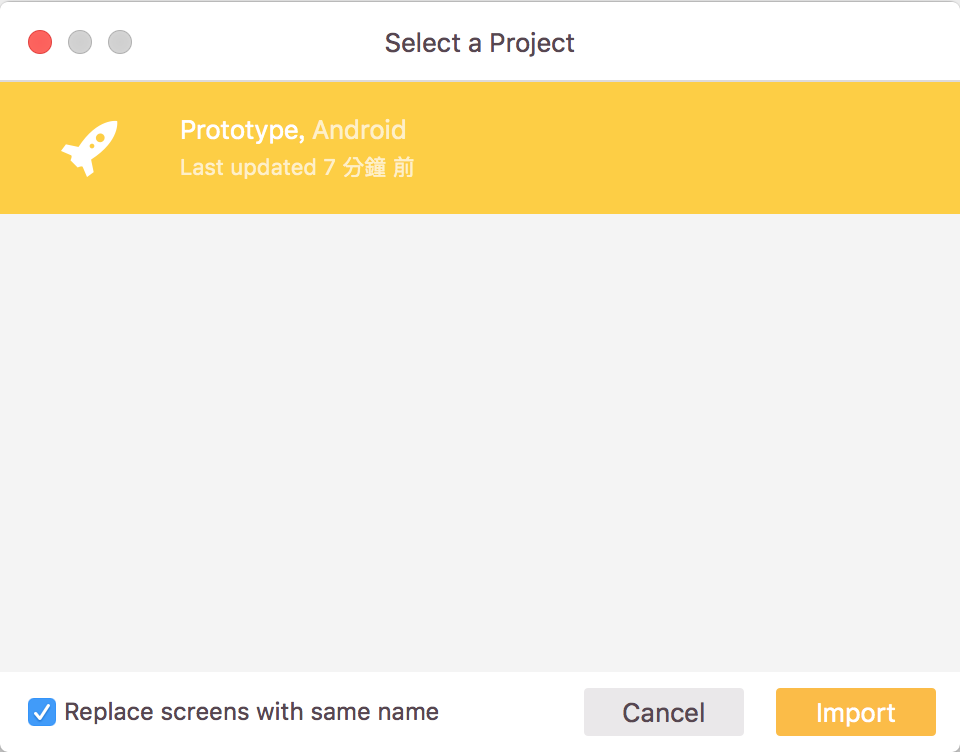

# Zeplin

專注於以直覺簡單的方式呈現規格，搭起設計師和工程師之間的橋樑，增加合作效率。

> [功能介紹](#功能介紹)  
> [安裝方式](#安裝方式)  
> [建立專案](#建立專案)  
> [輸出](#輸出)

## 功能介紹

1.  

## 安裝方式

1. 先至[官網](https://zeplin.io/)下載軟體

## 建立專案

1. 開啟Zeplin後點選畫面上的Create

2. 選擇平台

3. 專案建立完成，右側可在設定專案名稱或是專案解析度

## 輸出

1. 在Sketch中選取一個圖層

2. 點選Plugins -> Zeplin -> Exported Selected Artboards

3. 如已有使用Zeplin建立專案，可直接選擇專案輸出，如沒有則需[建立專案](#建立專案)

