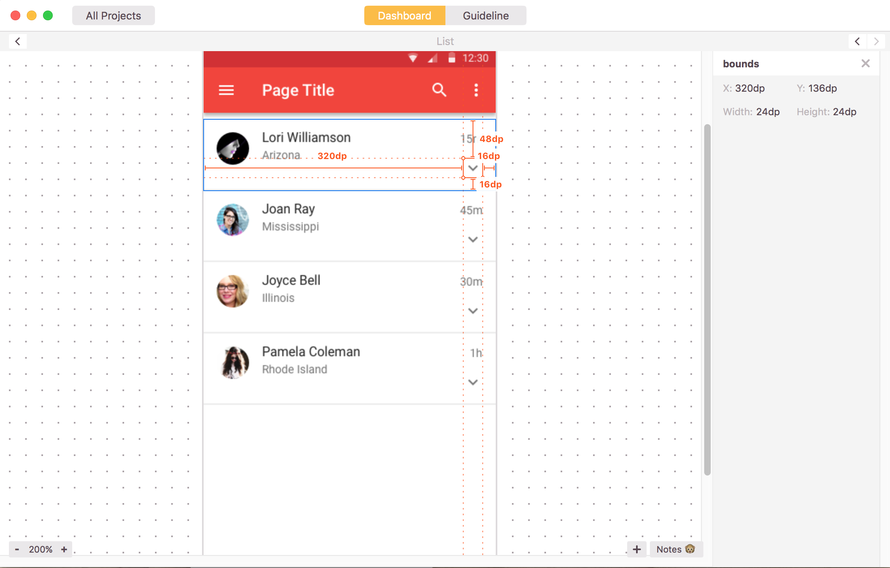
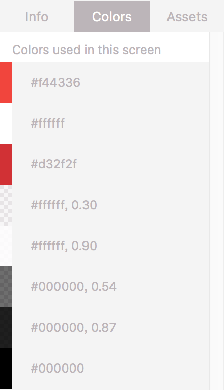
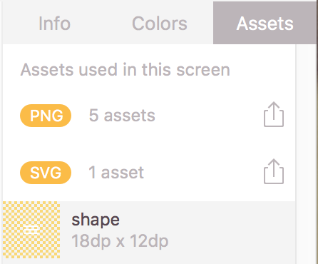
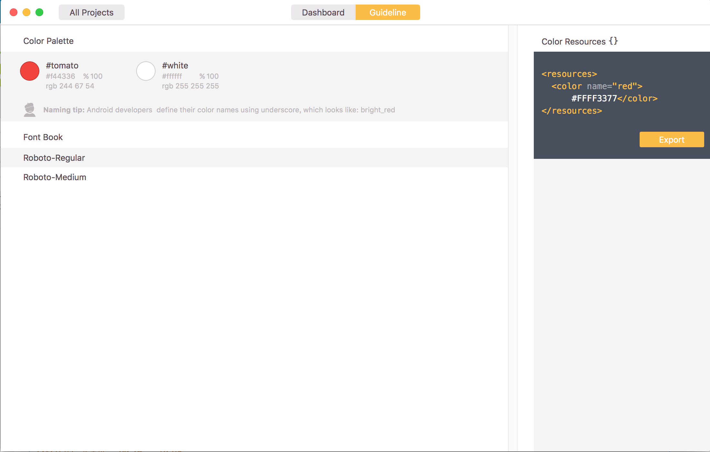
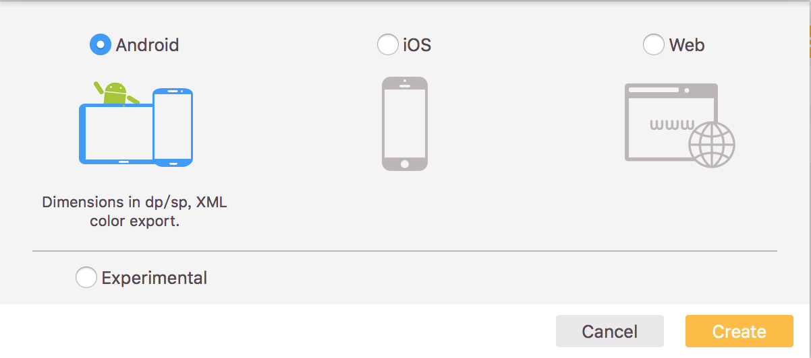
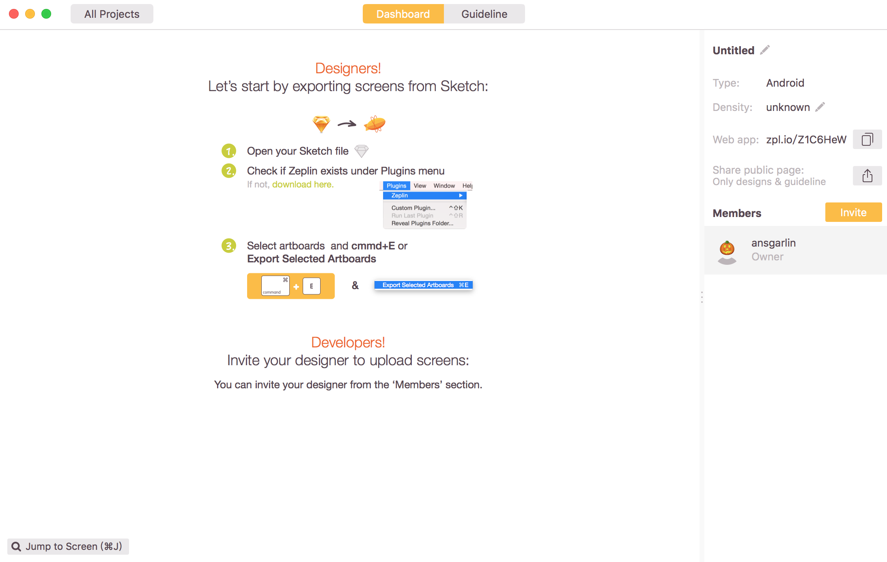
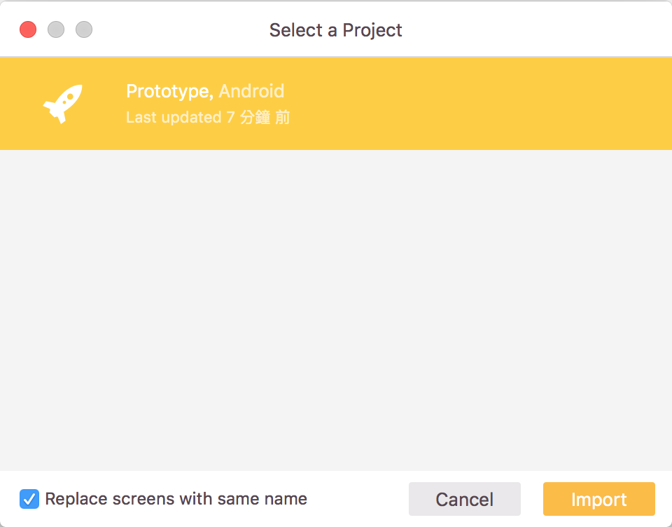

# Zeplin

專注於以直覺簡單的方式呈現規格，搭起設計師和工程師之間的橋樑，增加合作效率。

> [安裝方式](#安裝方式)  
> [功能介紹](#功能介紹)  
> [建立專案](#建立專案)  
> [輸出](#輸出)

## 功能介紹

* 可直接顯示圖形在Sketch中的大小和距離設定  

 

* 一次顯示當前畫面所擁有的色票

 

* 一次顯示當前畫面可輸出的圖片

 
> 
需要在Sketch中預先設置圖層是Exported

* 可選擇畫面中使用到的色票，並輸出成專案平台使用的資源檔

 

## 安裝使用

1. 先至[官網](https://zeplin.io/)下載軟體並安裝

2. 參照[Plugin](README.md)安裝

3. 參照[輸出](#輸出)的步驟即可從Sketch開啟

## 建立專案

1. 開啟Zeplin後點選畫面上的Create  
 

2. 選擇平台  

3. 專案建立完成，右側可在設定專案名稱或是專案解析度

## 輸出

1. 在Sketch中選取一個圖層  

2. 點選Plugins -> Zeplin -> Exported Selected Artboards

3. 如已有使用Zeplin建立專案，可直接選擇專案輸出，如沒有則需[建立專案](#建立專案)

