# Placeit

用於製作展示圖片、影片的網站，提供多種版型和情境，讓使用者可以快速建立展示素材並下載試用，只要上傳相符的檔案格式即可。

> [使用方式](#使用方式)

## 製作圖片

1. 在Print或是Appreal分頁選擇想要的素材

2. 點選進入製作頁

3. 上傳圖片並透過網站截圖

4. 製作完成

5. 下載基本大小或付費下載高解析度成品

## 製作影片

1. 在Digital分頁選擇Video分類，再選擇想要的素材
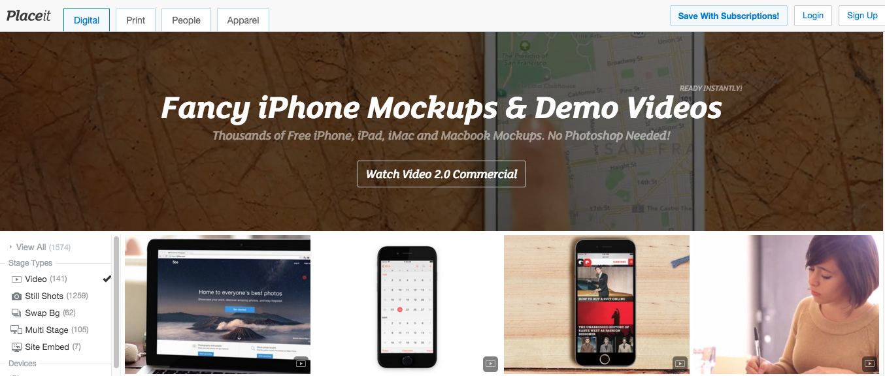

2. 點選進入製作頁
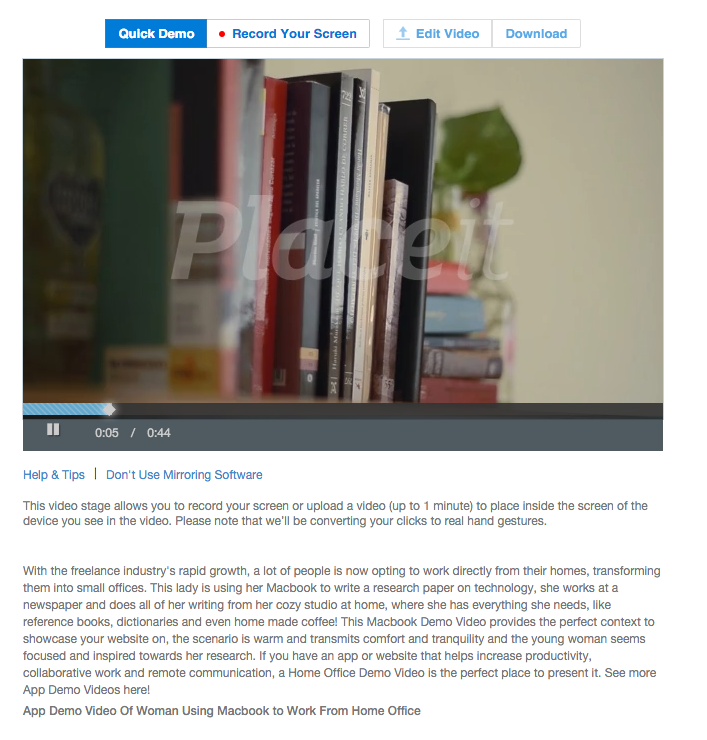

3. 點選QuickDemo將已上線的網址嵌入並製作影片
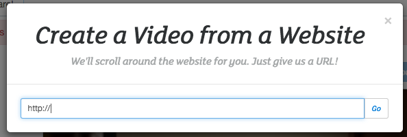

4. 點選Record Your Screen來錄製螢幕操作並製作影片，如第一次使用錄製，會需要先下載一個APP並安裝
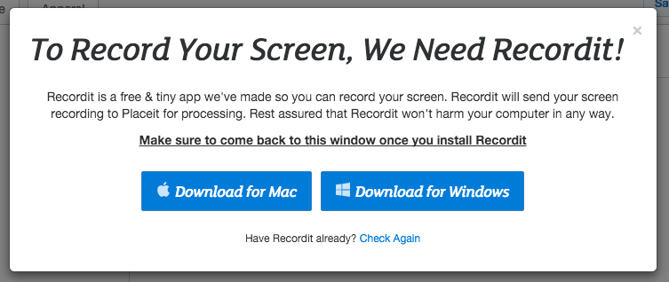

5. 安裝後再選擇Record Your Screen會跳出此訊息
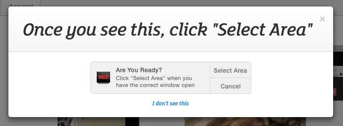

6. 確定後畫面會產生標線，請用此標線匡出想要錄製的範圍
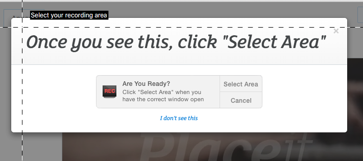

7. 在Mac上方工具列會產生一小圖示，點選後開始錄製
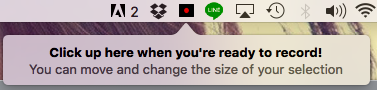

8. 開始錄製後圖示會變成STOP，再按一次結束錄製 
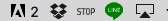

9. 結束錄製會跳出訊息提示
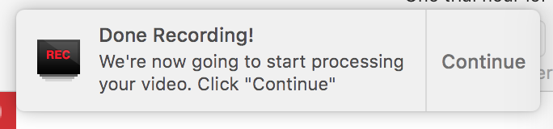

10. 後製處理完後會呈現合成結果在網頁上
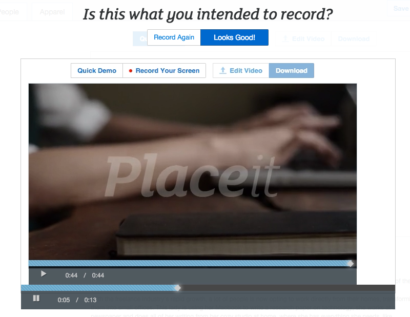

11. 點選Looks Good完成
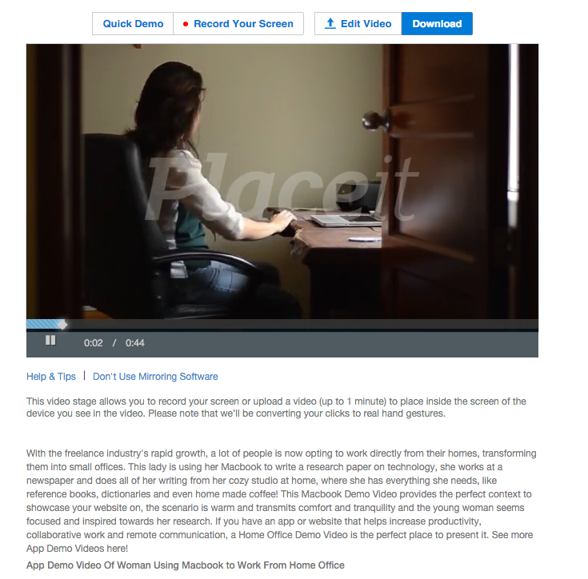

12. 下載基本大小或付費下載高解析度成品
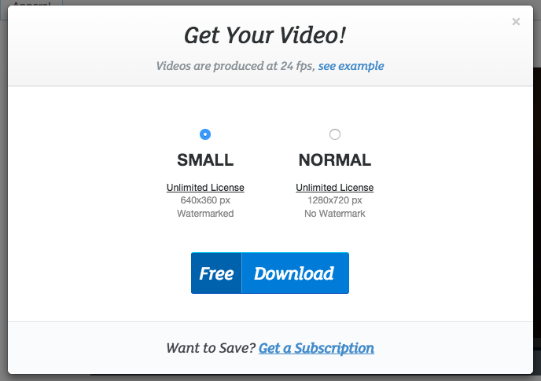
